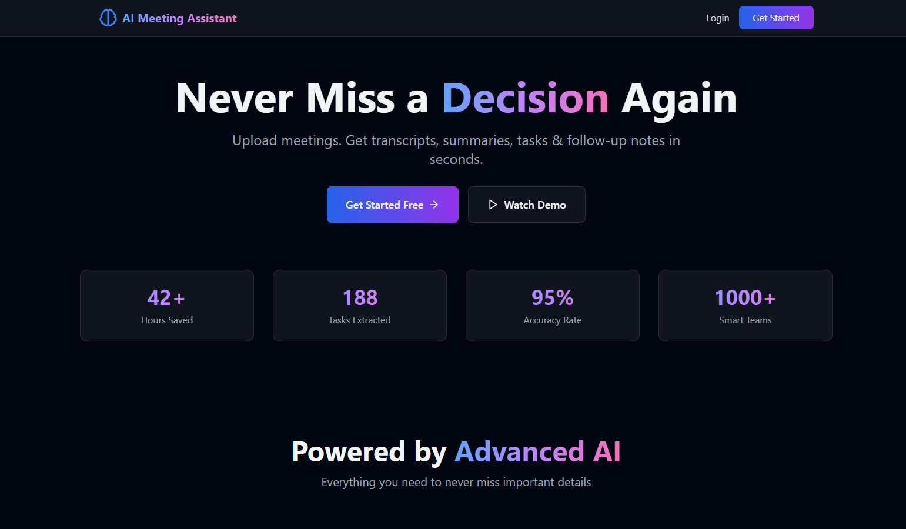
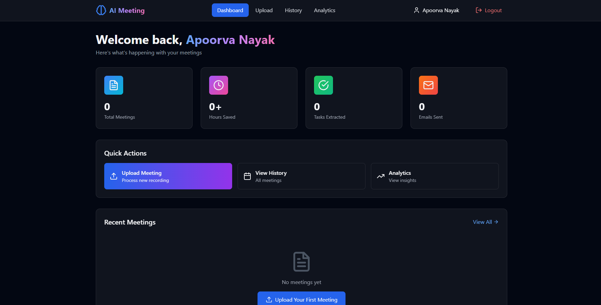
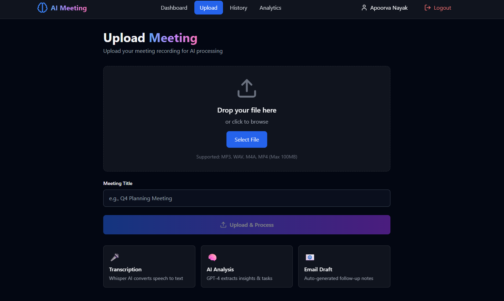
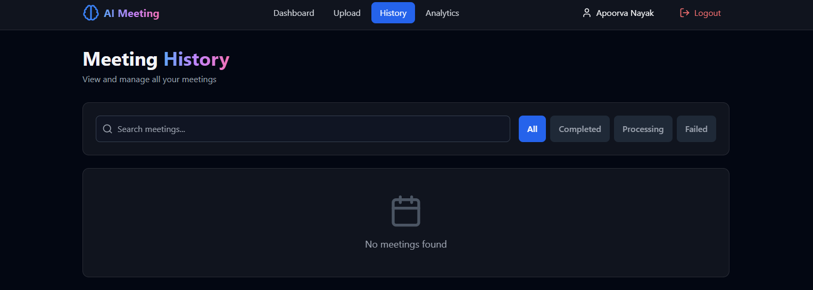
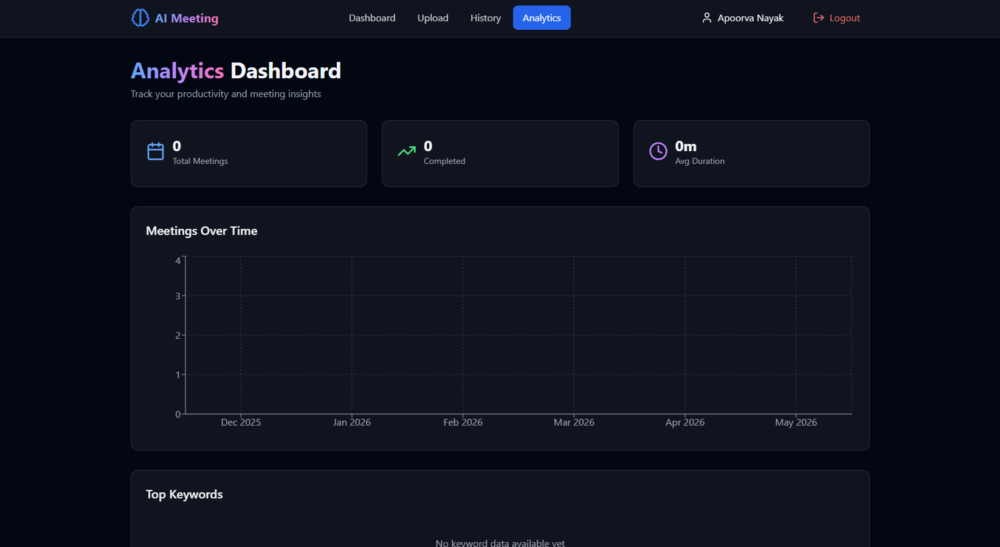
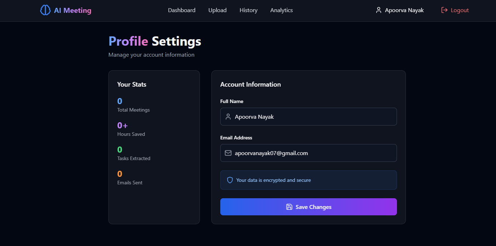

# 🚀 AI Meeting Summary & Task Extractor

## Premium AI-Powered Meeting Assistant Platform
  
Never miss a decision again. Upload meetings, get transcripts, summaries, tasks & follow-up notes in seconds.
 
## Screenshots

### Landing page
 

### Dashboard
 
  
### Upload
 

### History 


### Analytics


### Profile Section


## ✨ Features

- 🎤 **Audio/Video Transcription** - Whisper API powered speech-to-text
- 🧠 **AI Summaries** - Smart meeting insights using Gemini/OpenAI
- ✅ **Task Extraction** - Automatic action items with deadlines
- 👥 **Speaker Identification** - Multi-speaker conversation tracking
- 📧 **Auto Email** - Professional follow-up notes generation
- 📊 **Analytics Dashboard** - Productivity metrics and insights
- 🔍 **AI Chat** - Ask questions about your meetings
- 🌐 **Multi-language** - Translate transcripts

## 🛠️ Tech Stack

### Frontend
- React.js + Vite
- Tailwind CSS
- Framer Motion
- Recharts
- React Router
- Axios

### Backend
- Node.js + Express.js
- MongoDB Atlas
- JWT Authentication
- Multer (file uploads)
- Nodemailer

### AI APIs
- OpenAI Whisper API (transcription)
- OpenAI GPT-4 / Google Gemini (summaries)

## 📦 Installation

### Prerequisites
- Node.js 18+
- MongoDB Atlas account
- OpenAI API key

### Setup

1. **Clone and install dependencies**
```bash
npm run install-all
```

2. **Backend Configuration**

Create `backend/.env`:
```env
PORT=5000
MONGODB_URI=your_mongodb_connection_string
JWT_SECRET=your_jwt_secret_key
OPENAI_API_KEY=your_openai_api_key
EMAIL_USER=your_email@gmail.com
EMAIL_PASS=your_app_password
CLIENT_URL=http://localhost:5173
```

3. **Frontend Configuration**

Create `frontend/.env`:
```env
VITE_API_URL=http://localhost:5000/api
```

4. **Run Development**
```bash
npm run dev
```


## 📁 Project Structure

```
ai-meeting-assistant/
├── frontend/               # React frontend
│   ├── src/
│   │   ├── components/    # Reusable components
│   │   ├── pages/         # Page components
│   │   ├── hooks/         # Custom hooks
│   │   ├── utils/         # Utilities
│   │   └── App.jsx
│   └── package.json
├── backend/               # Express backend
│   ├── models/           # MongoDB models
│   ├── routes/           # API routes
│   ├── middleware/       # Auth & validation
│   ├── controllers/      # Business logic
│   └── server.js
└── package.json
```

## 🎯 Key Features Showcase

### Dashboard
- Total meetings processed
- Hours saved calculation
- Tasks extracted count
- Weekly productivity charts

### AI Processing
- Speech-to-text transcription
- Executive summary generation
- Action items extraction
- Sentiment analysis
- Speaker identification

### Smart Extraction
- Tasks with assignees
- Deadlines and priorities
- Decisions made
- Risks discussed
- Follow-up suggestions

## 🔐 Security

- JWT authentication
- Password hashing (bcrypt)
- Input validation
- Rate limiting
- CORS configuration
- Secure file uploads

## 📊 API Endpoints

### Authentication
- `POST /api/auth/register` - User registration
- `POST /api/auth/login` - User login
- `GET /api/auth/me` - Get current user

### Meetings
- `POST /api/meeting/upload` - Upload meeting file
- `POST /api/meeting/process` - Process with AI
- `GET /api/meeting/history` - Get all meetings
- `GET /api/meeting/:id` - Get meeting details
- `DELETE /api/meeting/:id` - Delete meeting
- `POST /api/meeting/:id/chat` - Chat with transcript

### Email
- `POST /api/email/send` - Send follow-up email

## 🎨 Design Features

- Dark modern UI with glassmorphism
- Smooth animations (Framer Motion)
- Responsive mobile + desktop
- Beautiful charts and visualizations
- Premium SaaS aesthetics

## 📈 Analytics

- Meetings per month
- Average duration tracking
- Common keywords analysis
- Time saved estimates
- Task completion rates

## 🤝 Contributing

This is a portfolio/interview project. Feel free to fork and customize!

## 📄 License

MIT License

## 🌟 Showcase Stats

- "Saved 42+ hours this month"
- "Extracted 188 action items"
- "Used by smart teams"

---

Built with ❤️ for productivity and AI innovation
